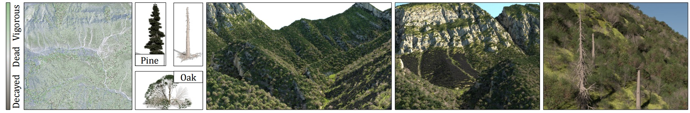
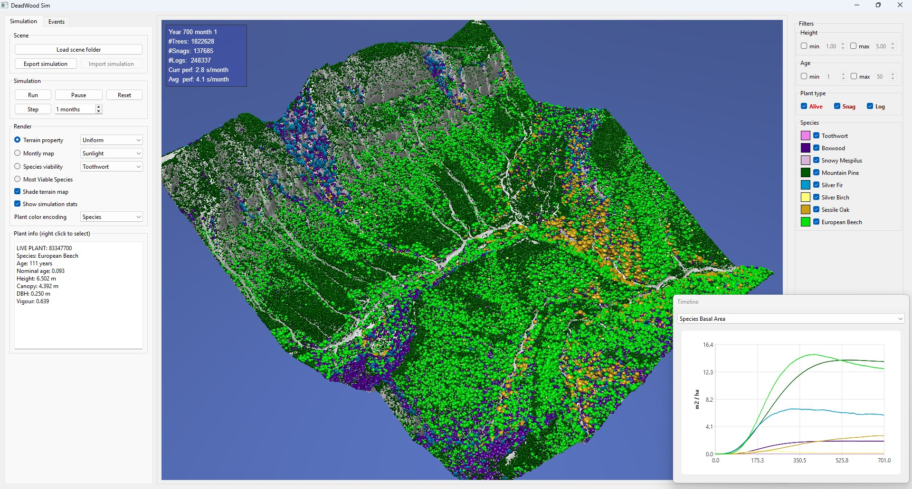

# DeadWood: Including Disturbance and Decay in the Depiction of Digital Nature


 **DeadWood: Including Disturbance and Decay in the Depiction of Digital Nature**.
 *Adrien Peytavie, James Gain, Eric Guérin, Oscar Argudo, Eric Galin*.
 ACM Transactions on Graphics, presented at SIGGRAPH 2024.
 Authors' implementation.
 
*Abstract*: The creation of truly believable simulated natural environments remains an unsolved problem in Computer Graphics. This is, in part, due to a lack of visual variety. In nature, apart from variation due to abiotic and biotic growth factors, a significant role is played by disturbance events, such as fires, windstorms, disease, and death and decay processes, which give rise to both standing dead trees (snags) and downed woody debris (logs). For instance, snags constitute on average 10% of unmanaged forests by basal area, and logs account for 2.5 times this quantity.
While previous systems have incorporated individual elements of disturbance (e.g., forest fires) and decay (e.g., the formation of humus), there has been no unifying treatment, perhaps because of the challenge of matching simulation results with generated geometric models.
In this paper, we present a framework that combines an ecosystem simulation, which explicitly incorporates disturbance events and decay processes, with a model realization process, which balances the uniqueness arising from life history with the need for instancing due to memory constraints. We tested our hypothesis concerning the visual impact of disturbance and decay with a two-alternative forced-choice experiment (n = 116). Our findings are that the presence of dead wood in various forms, as snags or logs, significantly improves the believability of natural scenes, while, surprisingly, general variation in the number of model instances, with up to 8 models per species, and a focus on disturbance events, does not.


## Description

This repository contains the authors' implementation of the paper, with the addition of a UI interface and an interactive 3D view of the simulation.



### Compiling the code

Currently, we only provide a Visual Studio solution. It has been tested on Windows 10 and Windows 11, using Microsoft Visual Studio Community 2022 (64-bit) with the Qt VS Tools extension version 3.4.0 and Qt version 6.8.3.

The following external libraries are required but *not included* in this repository. The project expects them to be available via the corresponding environment variables in parentheses, pointing to the root directory of each respective library in your system. 
- Qt 6.8 (QT_DIR)
- GLEW 2.1.0 (GLEW_DIR)
- GLM 1.0.1 (GLM_DIR)

After successfully building the project, you can use the ([Deploy.bat]) script to set up the application deployment. Basically, it copies the GLEW DLL into the debug/release executables directories and then calls `windeployqt` to gather all necessary Qt runtime dependencies.


### Windows binaries

If you do not want to compile the code, you can download the precompiled [binaries](https://github.com/oargudo/deadwood/releases/download/v1.0/app-deadwood.zip). See the [release](https://github.com/oargudo/deadwood/releases/tag/v1.0) notes for more information. 


### Running the application

The application executable runs with no assumptions about directory structure or other files needed. 

Upon opening, you can click on the `Load scene folder` button to locate and open a scene directory (see the next subsection for an explanation of the files in a scene directory). The application will then load the following information for the scene: the height field, the biome database, the allometric txt files, the abiotic files and the disturbance events list. 

If any of the three abiotic files are missing (temp, wet, sun) from the scene directory, the simulation will compute and save them automatically for future reuse. This process may take some time, particularly for the sunlight simulation. Progress messages will appear in the console to provide feedback during loading.

Once a scene is loaded, we will see the terrain on the 3D view and the species lists properly filled in the right hand side filters panel. Then, the simulation can be started with the `Run` button, to run it indefenitely, or with the `Step` button, which allows to specify a certain number of monthly steps.

At any moment, the scene can be dynamically inspected and the rendering parameters (ground texture, plant color encoding, filters) modified. Right clicking on a plant provides detailed information in the left text panel. Use the left mouse button to rotate, left+alt or middle button to pan, and left+shift or mouse wheel to zoom.


### Sample scenes

We include the Gresolet scene and biome used in the paper to illustrate our results. Since this scene is 2x2 km wide with a cell resolution of 2m, we also included a smaller 0.5x0.5 km crop for testing purposes. 

A scene folder should contain the following files:

| **File** | **Description** |
|----------|-----------------|
| `heightfield.elv` | The elevation grid in plain text format. The first row contains the number of rows, columns, cell spacing, and average latitude. Each subsequent row contains float values encoding elevation in meters. |
| `biome.db` | The biome database in SQLite format. Refer to the provided example to understand the expected tables and data structure. |
| `clim.txt` | The climate parameters in a 4-line text file. The first line specifies the elevation at which the data was measured. The next three lines contain twelve values each, corresponding to monthly temperatures (°C), percentage of clear-sky time, and rainfall (mm). |
| `almc_i.txt`, `almo_i.txt` | Allometric files where `i` is the species ID. Each species must have both files, representing growth in dense (`almc`) and isolated (`almo`) conditions. |
| `sun.txt`, `temp.txt`, `wet.txt` | Monthly grid maps for sunlight, temperature, and wetness. If present, their values are loaded directly. If any is missing, the simulation computes it during loading and saves the results for future reuse. |
| `disturbanceEvents.txt` | Optional file listing disturbance events. Each event begins with the year, month, and type, followed by type-specific parameters. See the implementation of [`ScriptedDisturbanceEvent::loadFromFile`](./AppEcosim/blob/main/source/disturbance_events.cpp#L21) for details. This file can also be created using the **Events** tab in the UI. |


### Acknowledgements

- The codebase upon which our simulator was built was the code for Kapp et al. "Data-driven Authoring of Large-Scale Ecosystems", available in their [repository](https://github.com/jgain/EcoLearn).
- The UI and render was developed by Adrià Lozano, student of the Bachelor Degree in Informatics Engineering at Universitat Politècnica de Catalunya.


## Article

The article is published in [ACM Transactions on Graphics](https://dl.acm.org/doi/10.1145/3641816).

If you use this code, please cite the paper:
```
@article{Peytavie2024deadwood,
    title = {DeadWood: Including disturbance and decay in the depiction of digital nature},
    author = {Peytavie, Adrien and Gain, James and Gu\'{e}rin, Eric and Argudo, Oscar and Galin, Eric},
    journal = {ACM Transactions on Graphics},
    year = {2024},
    volume = {43},
    number = {2},
    articleno = {21},
    numpages = {19},
    publisher = {Association for Computing Machinery},
    address = {New York, NY, USA},
    issn = {0730-0301},
    doi = {10.1145/3641816},
}
```
